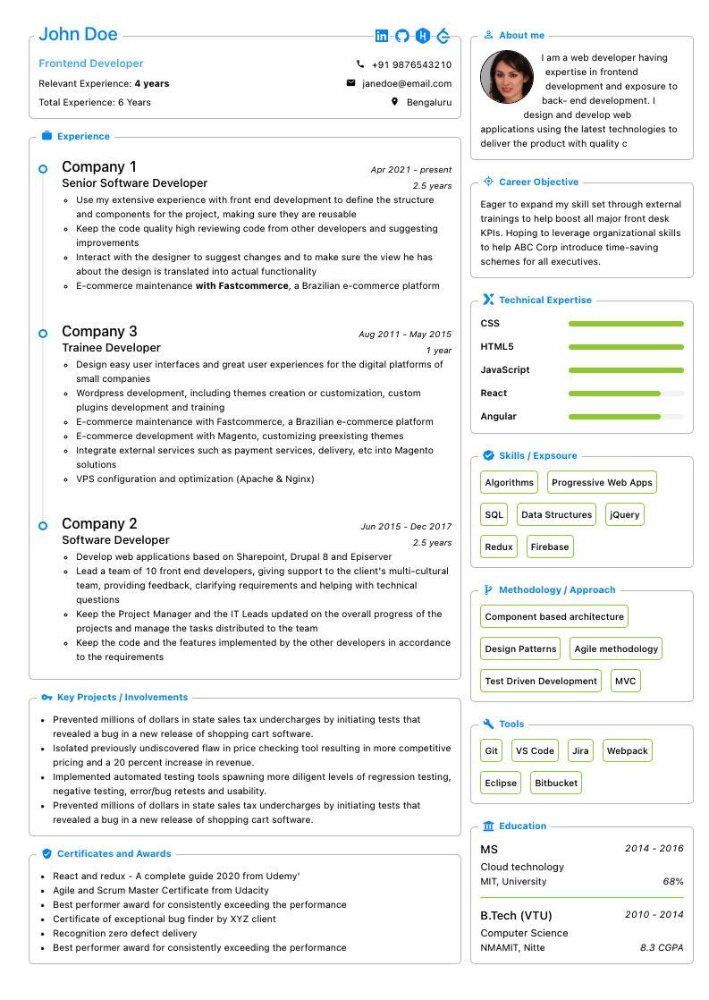
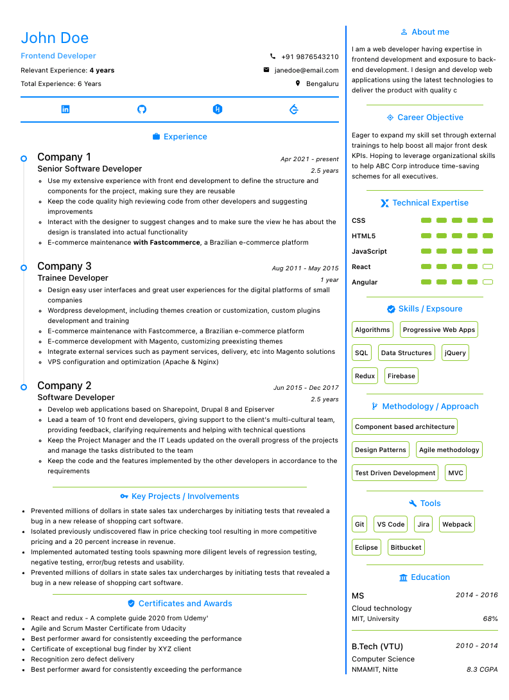

<h1>Single Page Resume Builder</h1>

### Free and open source, fully customizable professional single page resume builder

&nbsp;&nbsp;&nbsp;&nbsp;&nbsp;&nbsp;&nbsp;&nbsp;&nbsp;&nbsp;

👉 &nbsp;&nbsp;[Single Page Resume Builder](https://e-resume.vercel.app/)&nbsp;&nbsp;👈

- You Can Make Your Resume In This Format
  - Orientation: Portrait
  - Paper size: A4
  - Scale: Fit to width
  - Margins: None
  - Print headers & footers: Uncheck (remove tick mark)
  - Background/graphics: Check (add tick mark)

### Technologies

- [React](https://reactjs.org/) with hooks
- [Styled components](https://styled-components.com/) + [Antd](https://ant.design/docs/react/introduce) (css and component libraries)
- [Zustand](https://github.com/pmndrs/zustand) (hooks based state management library)
- [Next.js](https://nextjs.org/) (Bundler)

More features coming soon

---

